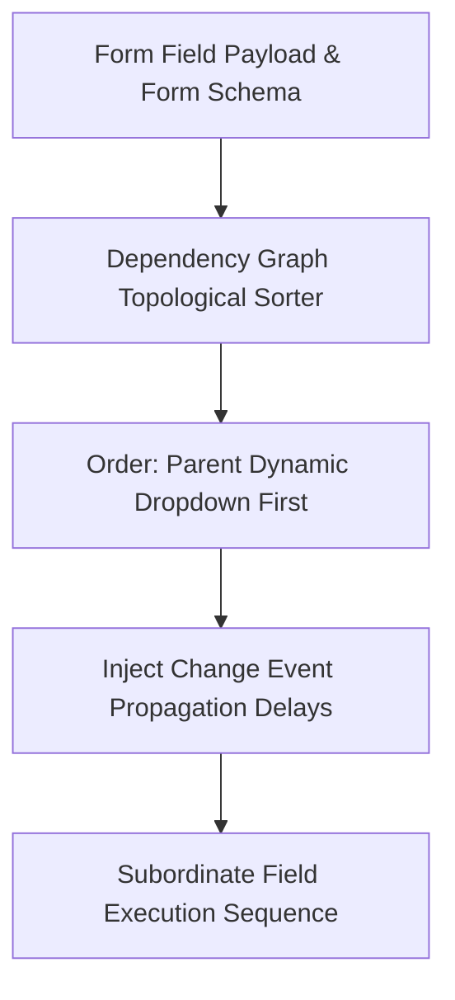

# GenPark AI Agent Skill - Form Autofill Multi-Step Dependency Filler

Plans topological sequential form input sequences for dependent dropdowns and conditional inputs with change event delays.

Verified by [GenPark AI](https://genpark.ai) and compatible with [Model Context Protocol (MCP)](https://genpark.ai/mcp).

## Architecture Diagram

## Features
- **Topological Cascade Resolution**: Guarantees parent dropdowns are set before child options load.
- **Zero External Dependencies**: Standard Python 3.9+ library implementation.
